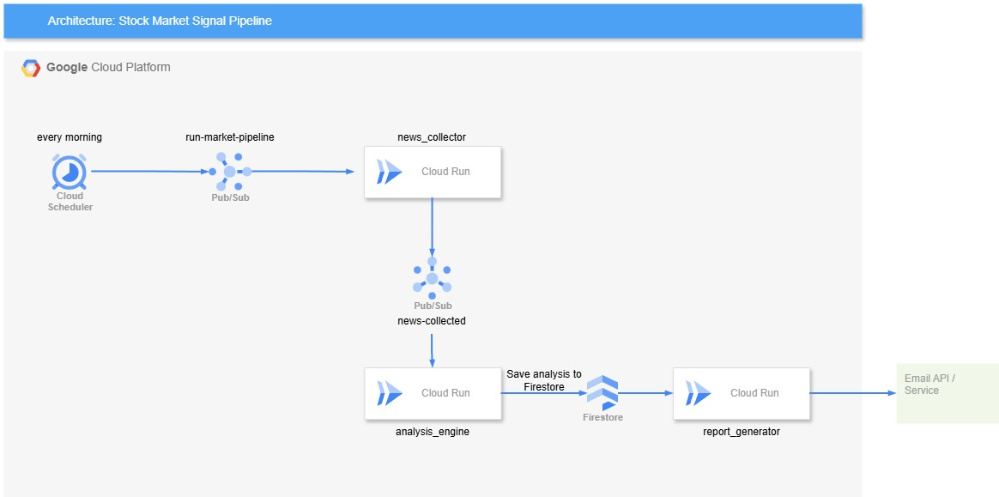

<!-- <h4 align="center">
    <br> 
</h4> -->

<h4 align="center">
    Market Signal Pipeline
</h4>

<p align="center">
    <a href="#description">Description</a> •
    <a href="#technology-stack">Tech Stack</a> •
    <a href="#architecture">Architecture</a> •
    <a href="#feature">Features</a> •
    <a href="#signal-model">Signal Model</a> •
    <a href="#example-report"> Example Report </a>
</p>

## Description

This project is event-driven fintech project that collects recent financial news and market data, calculates deterministic quantitative indicators, generates bullish, bearish, or neutral signals, stores result in Firestore and sends a daily email report.

This project demonstrates practical software engineering, quantitative analysis, cloud deployment, and event-driven architecture on Google Cloud Platform (GCP).

The MVP monitors a stock watchlist, such as:

- `AAPL`
- `NVDA`
- `TSLA`

For each scheduled run, the system:

1. Publishes a market-analysis event through Cloud Scheduler and Pub/Sub.
2. Fetches recent financial news and market data.
3. Deduplicates and filters relevant articles.
4. Calculates technical indicators and create quantitative analysis in Python
5. Produces a bullish, bearish, or neutral signal with a confidence score.
6. Generates an evidence-grounded explanation using LLM API.
7. Stores the result in Firestore.
8. Sends one combined daily email report.

## Technology Stack

### Application

- Python
- FastAPI
- pandas
- NumPy
- pandas-ta
- yfinance
- Terraform

### Google Cloud Platform

- Cloud Scheduler
- Pub/Sub
- Cloud Run
- Firestore
- Secret Manager
- Artifact Registry
- Cloud Logging

### External Integration

- undecided

## Architecture



## Feature

### Event-driven execution

Cloud Scheduler publishes a daily event to Pub/Sub. An authenticated push subscription invokes the Cloud Run services to publish the job.

### Deterministic quant engine

The signal engine calculates technical indicators directly in Python:

- 20-day simple moving average (`SMA20`)
- 50-day simple moving average (`SMA50`)
- Relative Strength Index (`RSI`)
- Moving Average Convergence Divergence (`MACD`)
- volume ratio

The language model is used only for evidence-grounded summarization or classification. It does not calculate the final signal.

### Explainable reports

Each report includes:

- ticker symbol;
- bullish, bearish, or neutral classification;
- confidence score;
- indicator summary;
- key news themes;
- risk notes;
- article references.

## Signal Model

Each component is normalized to the range `[-1.0, 1.0]`.

```text
final_score =
  0.35 * news_score +
  0.25 * momentum_score +
  0.20 * rsi_score +
  0.10 * macd_score +
  0.10 * volume_score
```

Initial classification thresholds:

```text
final_score >=  0.35  → bullish
final_score <= -0.35  → bearish
otherwise             → neutral
```

Confidence score:

```text
confidence_score = min(abs(final_score), 1.0)
```

These values are configurable MVP defaults. They are not validated investment logic and should be evaluated through backtesting.

## Local Docker Example

Build the container:

```bash
docker build -t market-signal-pipeline .
```

Run the live quant example:

```bash
docker run --rm market-signal-pipeline
```

Override the ticker or news score:

```bash
docker run --rm market-signal-pipeline msp-quant-example --ticker AAPL --news-score 0.25
```

## Example Report

```text
Daily Market Signal Report
Generated: 2026-06-06

NVDA
Signal: Bullish
Confidence score: 0.71

Summary:
Recent news sentiment is positive, price momentum remains above short-term
moving averages, and MACD indicates continued strength. Volatility remains
elevated.

Indicators:
- SMA20 trend: Positive
- SMA50 trend: Positive
- RSI: Neutral
- MACD: Positive
- Volume confirmation: Moderate

Risk note:
This output is an informational model signal, not a guaranteed prediction.
```
